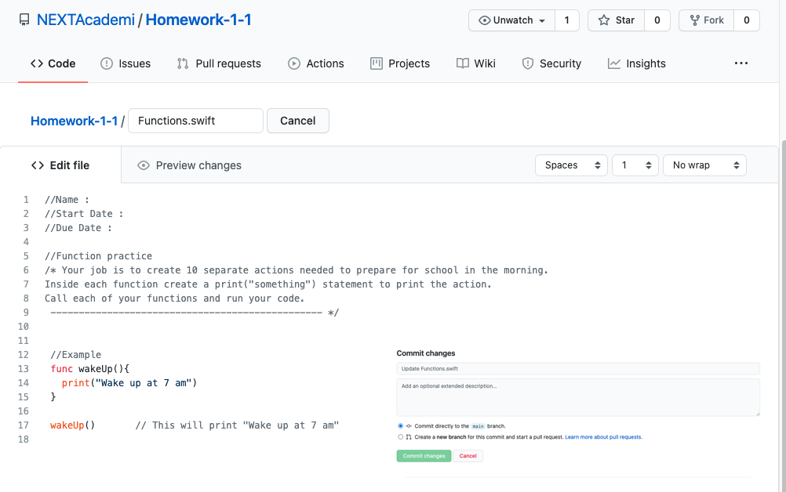

# Homework-1-1
Function Practice Homework

Step 1 : Open Playground and goto See All

Step 2 : Download My Playground

Step 3 : Make sure the Swift Version is 5.3 or Higer in the My Playground Blank App.

  

Step 4 : Copy and Paste the code in Homework 1-1 into Playground.

Step 5 : Run your homework in playground 

Step 6 : When it runs without errors copy and paste your code to Functions.swift file and hit commit to save.

  

